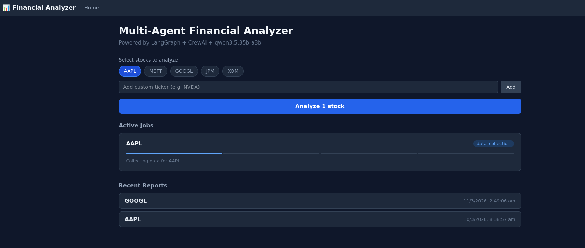
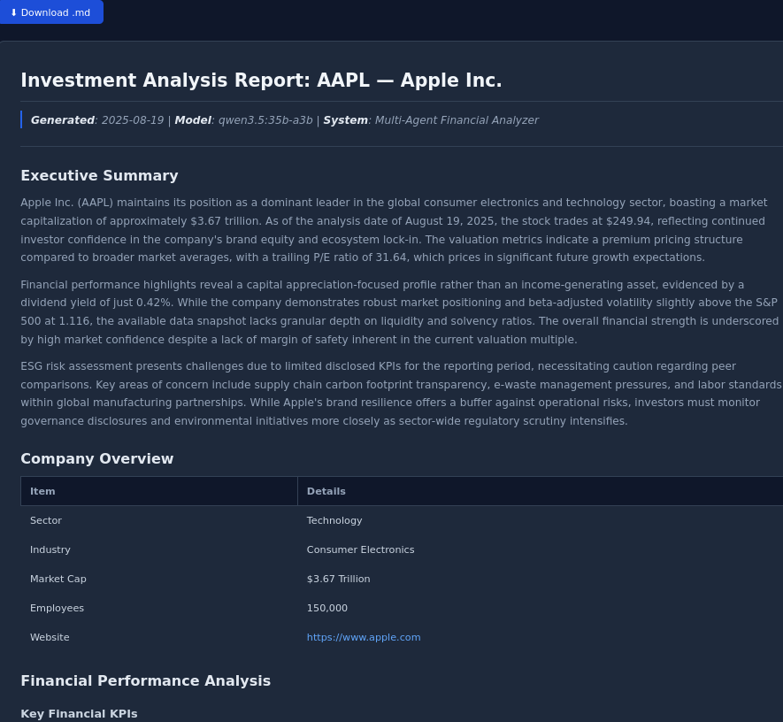
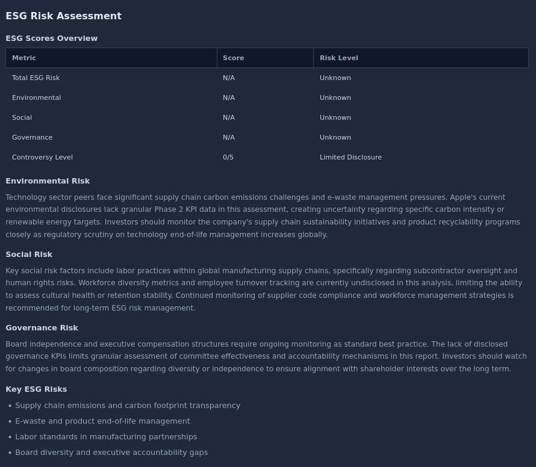

# EquityIQ — Local-First Multi-Agent AI Investment Research Platform

> Analyze any publicly traded stock with a 4-agent AI pipeline running entirely on your local machine — no cloud API fees, no data privacy concerns.

[](https://www.python.org/)
[](https://fastapi.tiangolo.com/)
[](https://react.dev/)
[](https://crewai.com/)
[](https://langchain-ai.github.io/langgraph/)
[](LICENSE)

---

## Overview

**EquityIQ** is a full-stack AI research platform that generates professional-grade investment reports for any publicly traded company. It orchestrates four specialized AI agents — each with a distinct financial role — through a reliable LangGraph pipeline, backed by dual-layer caching and real-time WebSocket progress updates.

All language model inference runs locally via **Ollama** (Qwen 3.5 35B), meaning your financial queries never leave your machine.

### What It Produces

Given a stock ticker (e.g., `AAPL`), EquityIQ generates a structured Markdown report covering:

- **Executive Summary** — investment thesis and key highlights
- **18+ Financial KPIs** — profitability, valuation, growth, leverage, liquidity, cash flow
- **ESG Risk Assessment** — Sustainalytics scores with peer comparison and investment implications
- **Analyst Commentary** — CFA-style narrative interpretation of every metric
- **Risk Factors** — identified risks with severity ratings

---

## Screenshots

### Analysis Dashboard


### Investment Report


### ESG Risk Assessment


---

## Architecture

```
┌─────────────────────────────────────────────────────────────┐
│                        React Frontend                        │
│          (Vite · React Router · WebSocket client)            │
└─────────────────────┬───────────────────────────────────────┘
                      │ HTTP / WebSocket
┌─────────────────────▼───────────────────────────────────────┐
│                   FastAPI Backend                            │
│              REST API  ·  WebSocket server                   │
└─────────────────────┬───────────────────────────────────────┘
                      │
┌─────────────────────▼───────────────────────────────────────┐
│              LangGraph Orchestration Pipeline                 │
│                                                              │
│  ┌──────────────┐  ┌──────────────┐  ┌──────────────┐  ┌──────────────┐  │
│  │    Agent 1   │→ │    Agent 2   │→ │    Agent 3   │→ │    Agent 4   │  │
│  │    Data      │  │  Financial   │  │     ESG      │  │   Report     │  │
│  │ Collection   │  │  Analysis    │  │   Scoring    │  │ Generation   │  │
│  └──────────────┘  └──────────────┘  └──────────────┘  └──────────────┘  │
└──────────┬──────────────────────────────────────────────────┘
           │
┌──────────▼──────────────────────────────────────┐
│            Infrastructure Layer                  │
│   Ollama (Qwen 3.5 35B)  ·  Redis (L1+L2)       │
│   SQLite (persistence)   ·  Yahoo Finance API    │
└──────────────────────────────────────────────────┘
```

### Agent Pipeline

| Agent | Role | Responsibility |
|-------|------|---------------|
| **Data Collection** | Senior Financial Data Analyst | Fetches price history, income statement, balance sheet, cash flow, and ESG data via Yahoo Finance |
| **Financial Analysis** | CFA-Level Analyst | Computes 18+ KPIs, identifies trends, produces structured JSON with analyst commentary |
| **ESG Scoring** | ESG Risk Analyst | Evaluates Sustainalytics scores, assigns risk levels, compares to sector peers |
| **Report Generation** | Investment Report Writer | Synthesizes all outputs into a professional Markdown report |

### Caching Strategy

```
Request
   │
   ├─► L1 Cache (Redis)          ← Raw market data  (TTL: 1h price / 24h financials)
   │       hit? → return immediately
   │       miss? → fetch from Yahoo Finance → cache → continue
   │
   └─► L2 Semantic Cache (Redis) ← LLM responses    (TTL: 6h)
           Ollama embeddings (nomic-embed-text) + cosine similarity
           Threshold: 0.15 — avoids redundant LLM inference for similar queries
```

---

## Tech Stack

### Backend
| Category | Technology |
|----------|-----------|
| Web Framework | FastAPI + Uvicorn |
| Real-time | WebSockets (native FastAPI) |
| Agent Framework | CrewAI 1.10 |
| Workflow Orchestration | LangGraph 1.0 |
| LLM Provider | Ollama — Qwen 3.5 35B (local) |
| LLM Integration | LangChain + langchain-ollama |
| Semantic Cache | langchain-redis + nomic-embed-text |
| Financial Data | yfinance |
| Database ORM | SQLAlchemy 2.0 (async) + aiosqlite |
| Database | SQLite |
| Cache | Redis 7 (Docker) |
| Config | Pydantic Settings + python-dotenv |

### Frontend
| Category | Technology |
|----------|-----------|
| Framework | React 19 |
| Routing | React Router 7 |
| Build Tool | Vite 6 |
| HTTP Client | Axios |
| Markdown Renderer | react-markdown + remark-gfm |

---

## Features

- **Local-first privacy** — No data sent to cloud LLM providers; Ollama runs entirely on your machine
- **Real-time progress** — WebSocket-powered job tracking with per-step status updates in the UI
- **Dual-layer caching** — Redis L1 (raw data) + L2 (semantic LLM cache) minimizes redundant work
- **Persistent reports** — All reports stored in SQLite; browse history per ticker
- **Batch analysis** — Analyze multiple tickers in one request
- **ESG integration** — Sustainalytics ESG scores with investment-grade risk commentary
- **Professional output** — Reports formatted with tables, KPI summaries, and narrative analysis

---

## Prerequisites

| Requirement | Version | Purpose |
|-------------|---------|---------|
| Python | 3.12+ | Backend runtime |
| Node.js | 18+ | Frontend build |
| Docker | 24+ | Redis container |
| Ollama | Latest | Local LLM inference |

### Ollama Models

Pull the required models before starting:

```bash
ollama pull qwen3:30b-a3b      # Main reasoning model (~20GB)
ollama pull nomic-embed-text    # Embedding model for semantic cache
```

> You can substitute a smaller model (e.g., `qwen2.5:7b`, `mistral:7b`) in `.env` if hardware is constrained. Larger models produce significantly better reports.

---

## Quick Start

### 1. Clone the repository

```bash
git clone https://github.com/YOUR_USERNAME/equityiq.git
cd equityiq
```

### 2. Start Redis

```bash
docker compose up -d
```

### 3. Configure the backend

```bash
cd backend
cp .env.example .env
# Edit .env if your Ollama model name or ports differ
```

### 4. Install Python dependencies

```bash
python -m venv .venv
source .venv/bin/activate      # Windows: .venv\Scripts\activate
pip install -r requirements.txt
```

### 5. Start the backend

```bash
python run.py
# API available at http://localhost:8000
# Docs at http://localhost:8000/docs
```

### 6. Install and start the frontend

```bash
cd ../frontend
npm install
npm run dev
# UI available at http://localhost:5173
```

---

## Usage

1. Open `http://localhost:5173` in your browser
2. Select a ticker from the preset list (AAPL, MSFT, GOOGL, JPM, XOM) or type any valid stock symbol
3. Click **Analyze** — the pipeline starts immediately
4. Watch real-time progress as each agent completes its stage
5. Click **View Report** when complete to read the full investment report

### REST API

```bash
# Trigger analysis
POST /api/v1/analyze
{ "ticker": "NVDA" }

# Check job status
GET /api/v1/jobs/{job_id}

# Retrieve the latest report for a ticker
GET /api/v1/reports/{ticker}

# List all reports
GET /api/v1/reports

# Clear cache for a ticker
DELETE /api/v1/cache/{ticker}

# Batch analysis
POST /api/v1/analyze/batch
{ "tickers": ["AAPL", "MSFT", "GOOGL"] }
```

Interactive API documentation is available at `http://localhost:8000/docs`.

---

## Project Structure

```
equityiq/
├── backend/
│   ├── agents/                  # 4 CrewAI agent definitions
│   │   ├── data_collection_agent.py
│   │   ├── financial_analysis_agent.py
│   │   ├── esg_scoring_agent.py
│   │   └── report_generation_agent.py
│   ├── api/                     # FastAPI application
│   │   ├── main.py              # App entry, lifespan, CORS, health check
│   │   ├── ws_manager.py        # WebSocket connection + progress store
│   │   └── routes/
│   │       ├── analysis.py      # Analysis endpoints
│   │       └── reports.py       # Report retrieval endpoints
│   ├── workflow/                # LangGraph pipeline
│   │   ├── graph.py             # StateGraph definition
│   │   └── state.py             # FinancialAnalysisState TypedDict
│   ├── tools/                   # Agent tools
│   │   ├── yahoo_finance_tool.py
│   │   └── esg_tool.py
│   ├── database/                # SQLAlchemy models & async manager
│   ├── cache/                   # Redis L1 + L2 semantic cache
│   ├── config/                  # Pydantic settings loader
│   ├── requirements.txt
│   └── .env.example
├── frontend/
│   ├── src/
│   │   ├── pages/
│   │   │   ├── Home.jsx         # Dashboard & job management
│   │   │   └── Report.jsx       # Report viewer
│   │   ├── components/
│   │   │   ├── StockSelector.jsx
│   │   │   ├── AnalysisProgress.jsx
│   │   │   ├── ReportViewer.jsx
│   │   │   └── ESGScoreCard.jsx
│   │   └── services/api.js      # API + WebSocket client
│   ├── package.json
│   └── vite.config.js
└── docker-compose.yml           # Redis service
```

---

## Configuration Reference

All settings are controlled via `backend/.env`:

```env
# Ollama
OLLAMA_BASE_URL=http://localhost:11434
OLLAMA_MODEL=qwen3:30b-a3b          # Swap for any Ollama model
OLLAMA_EMBED_MODEL=nomic-embed-text

# Redis cache TTLs
REDIS_URL=redis://localhost:6379
REDIS_TTL_PRICE=3600                 # 1 hour  — stock price data
REDIS_TTL_FINANCIALS=86400           # 24 hours — financial statements
REDIS_TTL_LLM=21600                  # 6 hours  — LLM response cache

# Database
SQLITE_DB_PATH=./database/financial_analyzer.db

# Server
API_HOST=0.0.0.0
API_PORT=8000
DEBUG=false
```

---

## Roadmap

- [ ] **Phase 2 — Vector Store**: Weaviate integration for semantic report search and RAG over historical analyses
- [ ] **Multi-ticker comparison**: Side-by-side analysis dashboard for portfolio screening
- [ ] **Sector benchmarking**: Automatic peer group construction and relative valuation
- [ ] **Alert system**: Scheduled re-analysis with delta-based notifications
- [ ] **PDF export**: One-click export of investment reports

---

## License

This project is licensed under the MIT License. See [LICENSE](LICENSE) for details.

---

## Acknowledgements

- [CrewAI](https://crewai.com/) — multi-agent framework
- [LangGraph](https://langchain-ai.github.io/langgraph/) — workflow orchestration
- [Ollama](https://ollama.com/) — local LLM inference
- [yfinance](https://github.com/ranaroussi/yfinance) — Yahoo Finance data
- [FastAPI](https://fastapi.tiangolo.com/) — async web framework
